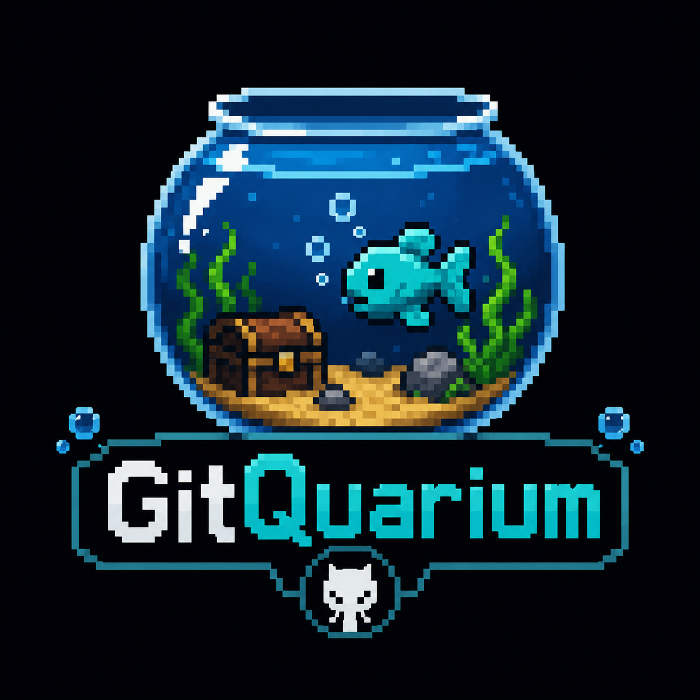
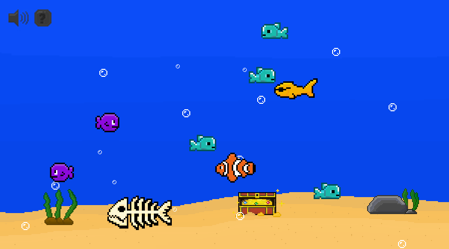
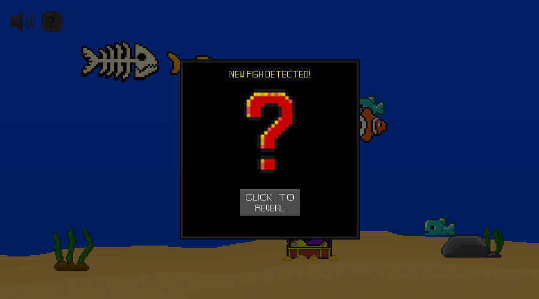
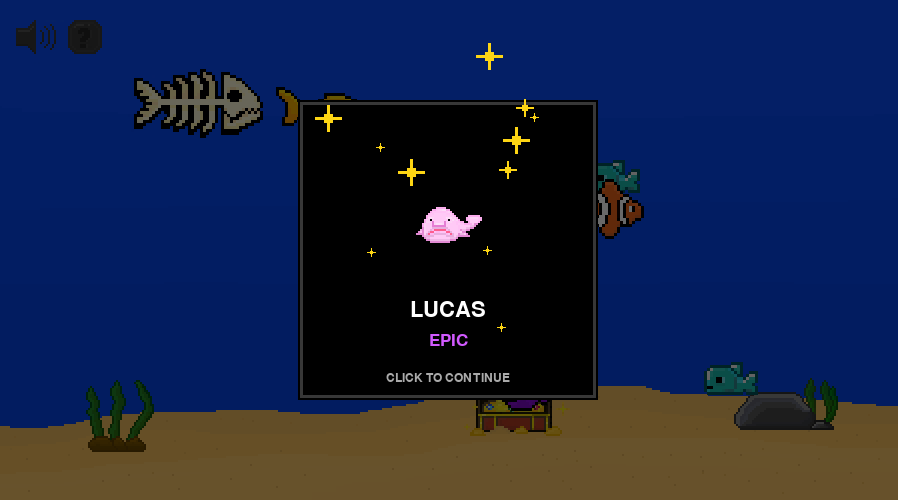
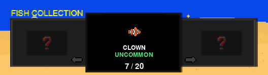
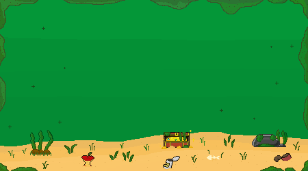

<p align="center">
  
</p>

<h1 align="center">GitQuarium</h1>

<p align="center">
  <strong>Your GitHub activity, but fish.</strong>
</p>

<p align="center">
  A tiny pixel-art aquarium where your GitHub commits become fish.
</p>

---

<p align="center">
  
</p>

## 🐟 What is GitQuarium?

GitQuarium turns your GitHub activity into a living pixel-art aquarium.

The rule is simple:

> **1 commit = 1 fish**

Make a commit, launch GitQuarium, and a new fish is waiting to be discovered.

Each fish belongs to a rarity tier, joins your aquarium permanently, and becomes part of your collection.

No productivity scores.  
No contribution streak optimization.  
Just fish.

## ✨ How it works

When GitQuarium starts, it checks your GitHub activity for commits it hasn't seen before.

If a new commit is found:

<p align="center">
  
</p>

You get a fish reveal with a randomly rolled species and rarity.

<p align="center">
  
</p>

The fish is then saved permanently and joins the aquarium.

## 🎲 Fish rarity

Every new commit rolls one of five rarity tiers:

| Rarity | Chance |
|---|---:|
| Common | 55% |
| Uncommon | 25% |
| Rare | 13% |
| Epic | 6% |
| Legendary | 1% |

The species is then randomly selected from that rarity's pool.

There are currently **20 fish species** to discover, including **James the Fish**, the one-of-one starter fish who cannot be rolled.

## 📖 Fish Collection

Your discoveries are tracked in the Fish Collection.

<p align="center">
  
</p>

Discovered species reveal their name and rarity, while fish you haven't found yet remain hidden.

Duplicates still join the aquarium — because apparently one Maude was not enough.

## 🌊 Your aquarium changes with you

GitQuarium doesn't just count commits.

Your aquarium reacts to how active you've been:

- **0–2 days since your last commit:** Clean
- **3–4 days:** Slightly dirty
- **5–6 days:** Dirty
- **7+ days:** Absolute swamp

<p align="center">
  
</p>

<p align="center">
  <em>Neglect your commits long enough and this is where your fish live.</em>
</p>

Stop coding long enough and your fish will be forced to live with the consequences.

## 🎮 Features

- GitHub commit detection
- 1 commit = 1 fish
- 20 unique fish species
- Five rarity tiers
- Animated fish with randomized movement
- Fish reveal system
- Persistent aquarium and collection
- GitHub activity-based tank decay
- Bubble effects
- Original pixel-art graphics
- Original GitQuarium soundtrack
- Sound effects and music controls
- Interactive fish
- Fish Collection browser
- Extremely important fish named things like Boner

## 🛠️ Built with

- **Python**
- **Pygame**
- **GitHub REST API**

Fish, environments and UI assets were created as custom pixel art.

## 🚀 Running GitQuarium

GitQuarium is available as a standalone Windows build.

No Python installation or manual environment setup is required.

### 1. Download GitQuarium

Download the latest Windows build from the [GitQuarium Releases](https://github.com/Samtoussi/GitQuarium/releases) page.

### 2. Extract the ZIP

Extract the downloaded ZIP somewhere on your computer.

GitQuarium needs the included `_internal` folder, so keep the extracted files together.

### 3. Start GitQuarium

Run:

```text
GitQuarium.exe
```

The first time you launch the game, GitQuarium will ask you to connect your GitHub account.

Enter your GitHub username and personal access token, then hit **CONNECT**.

Your token is stored locally on your computer and is never included in GitQuarium itself.

That's it.

Your GitHub activity is now fish.

## 🔑 GitHub token

GitQuarium uses the GitHub API to find your commits.

You'll need a GitHub personal access token when connecting your account for the first time.

You can create and manage personal access tokens in your [GitHub Developer Settings](https://github.com/settings/tokens).

Your token is stored only on your computer and should never be shared or committed to a repository.

## 💾 Local data

GitQuarium stores your configuration and aquarium save data locally in:

```text
%LOCALAPPDATA%\GitQuarium\
```

This includes:

```text
config.json
save.json
```

`config.json` stores your GitHub connection details.

`save.json` tracks previously seen commits and the fish you've collected.

These files are local to your computer and are not included in the GitQuarium download or repository.

## 🧑‍💻 Running from source

If you'd rather run GitQuarium directly from the source code:

### 1. Clone the repository

```bash
git clone https://github.com/Samtoussi/GitQuarium.git
cd GitQuarium
```

### 2. Create a virtual environment

```bash
python -m venv .venv
```

Activate it on Windows:

```bash
.venv\Scripts\activate
```

### 3. Install dependencies

```bash
pip install pygame requests python-dotenv
```

### 4. Configure GitHub

You can either connect your GitHub account through GitQuarium's first-time setup or create a `.env` file in the project root:

```env
GITHUB_USERNAME=your_github_username
GITHUB_TOKEN=your_github_token
```

Your `.env` file is ignored by Git and should never be committed.

### 5. Start GitQuarium

```bash
python aquarium.py
```

## 🐠 Philosophy

GitQuarium started as a deliberately small side project.

It is not trying to optimize your productivity.

It is not trying to gamify your career.

It turns commits into fish.

That's enough.

---

<p align="center">
  <strong>GitQuarium</strong>
  <br>
  Your GitHub activity, but fish.
</p>